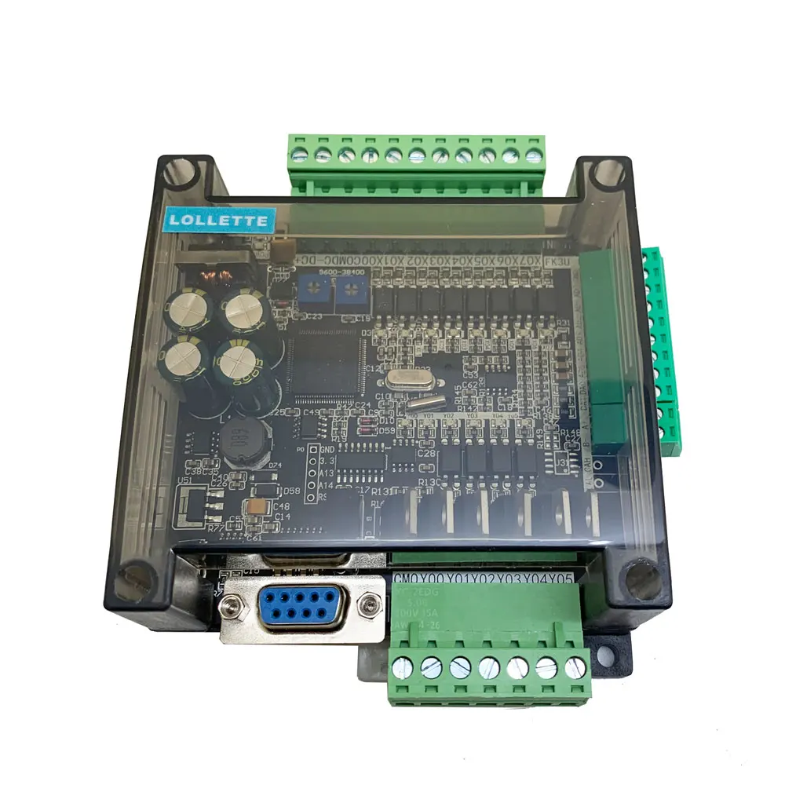

# General information about the MELA-board

``MELA-board`` является контроллером с открытым кодом на основе
``Python`` для промышленного использования и проектов IoT.

``MELA-board`` выполнена на основе микроконтроллера ESP32-S3 N32R8V Flash 16 MB
PSRAM 8 MB частота 240 MHz.

``MELA-board`` для управления внешними устройствами имеет изолированные входы-выходы,
порты обмена данными RS-485, RS-232, SPI, I2C, а также встоенный модуль WiFi.

Для визуального контроля и ручной настройки ``MELA-board`` имеет возможность
подключения HMI по протоколам ``modbus RTU`` и ``modbus TCP``.

Использование ``Python-платформы`` с открытым кодом для управления ``MELA-board``
позволяет опираться в разработках на большое количество прикладных библиотек и
делает процесс написания и отладки программ простым и наглядным.

Нумерация контактов ``MELA-board`` не соответствует нумерации контроллера
ESP32. Для установления необходимых номеров контактов приведена таблица пинов.

## Прикладная библиотека ``mela``

Прикладная библиотека ``mela`` предназначена для адаптации известных классов
``micropython`` под конфигурацию ``MELA-board``. При создании реальных проектов
для избежания возможных ошибок рекомендуется пользоваться прикладной
библиотекой ``mela``. Однако, типовые библиотеки ``micropython`` также можно
использовать при внимательной настройке параметров.

## Technical specifications

The datasheets and other reference material for ESP32-S3 chip are available
from the vendor site: https://www.espressif.com/en/products/socs/esp32-s3.

They are the primary reference for the chip technical specifications, capabilities,
operating modes, internal functioning, etc.

For your convenience, below are some technical characteristics of ``MELA-board``:

**MELA F1**

- Processor: Espressif ESP32-S3R16V:
    - Architecture: Xtensa Dual-Core 32-bit LX7
    - RISC-V Ultra Low Power Co-processor
    - CPU frequency: up to 240MHz
    - Internal FlashROM: 16MB
    - External FlashROM: Octal SPI PSRAM 8MB
    - WiFi: 2.4GHz Wifi - 802.11b/g/n, 3D High Gain Antenna
- RTC: DS1307 with a CR1220 coin cell battery
- ADC: 16-bit delta-sigma ADC ADS1115 up to 4 differentials channels 860SPS [0-10V / 0-20mA]
- Digital Input: 6 Digital Isolated Input [0-24V]
- Didital Output: 10; 6 PWM - Digital Isolated Output OC [0-24V 2A]; 4 Relay [250V 5A]
- GPIO: 3 Digital Input-Output TTL [3.3V]
- USB: USB CH340 + USB OTG + USB JTAG
- UART: 3 RX/TX UART
- I2C: 2; I2C-1 Isolated input
- RS-232: UART1
- RS-485: UART2
- Board Indicator: Low power RGB LED PL9823
- Control: ON/OFF button
- Reset: Outer Reset Pin
- Boot: Outer Boot Pin
- Power: 5-24V 200mW Power Pin / 5V 500mA USB

The board can be powered from a USB connector with a voltage of 5 volts.

For more information see the MELA-board datasheet:
https://github.com/gmecc/mela/blob/main/images/board-env.jpg

MicroPython is implemented on top of the ESP-IDF, Espressif’s development framework for the ESP32.
This is a FreeRTOS based system. See the ESP-IDF Programming Guide for details.

## GPIO table

.. csv-table:: 
    :header: "Pin", "GPIO", "BOARD", "Type", "Function"
    :widths: 10, 15, 15, 10, 50

    "1", "GND"
    "2", "3V3"
    "3", "EN", "RESET", "T", "Outer RESET"
    "4", "IO4", "SDA0", "IsIO", "I2C0 SDA0"
    "5", "IO5", "SDL0", "IsIO", "I2C0 SDL0"
    "6", "IO6", "LED", "O", "LED RGB"
    "7", "IO7", "RS-485 Tx", "IsIO", "UART2 RS-485 Tx"
    "8", "IO15", "RS-485 Rx", "IsIO", "UART2 RS-485 Rx"
    "9", "IO16", "RS-485 RTC", "IsIO", "UART2 RS-485 RTC"
    "10", "IO17", "RS-232 Tx", "IsIO", "UART1 RS-232 Tx"
    "11", "IO18", "RS-232 Rx", "IsIO", "UART1 RS-232 Rx"
    "12", "IO8", "?"
    "13", "IO19", "USB", "IO", "USB Serial JTAG"
    "14", "IO20", "USB", "IO", "USB Serial JTAG"
    "15", "IO3", "DI0", "IsI", "Digital Input [0-24V]"
    "16", "IO46", "DI1", "IsI", "Digital Input [0-24V]"
    "17", "IO9", "DI2", "IsI", "Digital Input [0-24V]"
    "18", "IO10", "DI3", "IsI", "Digital Input [0-24V]"
    "19", "IO11", "DI4", "IsI", "Digital Input [0-24V]"
    "20", "IO12", "DI5", "IsI", "Digital Input [0-24V]"
    "21", "IO13", "COM0", "R", "Reley [250V 5A]"
    " ", " ", "NO0", "R", "Reley [250V 5A]"
    " ", " ", "NC0", "R", "Reley [250V 5A]"
    "22", "IO14", "COM1", "R", "Reley [250V 5A]"
    " ", " ", "NO1", "R", "Reley [250V 5A]"
    " ", " ", "NC1", "R", "Reley [250V 5A]"
    "23", "IO21", "COM2", "R", "Reley [250V 5A]"
    " ", " ", "NO2", "R", "Reley [250V 5A]"
    " ", " ", "NC2", "R", "Reley [250V 5A]"
    "24", "IO47", "COM3", "R", "Reley [250V 5A]"
    " ", " ", "NO3", "R", "Reley [250V 5A]"
    " ", " ", "NC3", "R", "Reley [250V 5A]"
    "25", "IO48", "PWM10", "OC", "PWM [24V 2A]"
    "26", "IO48", "PWM10", "OC", "PWM [24V 2A]"
    "27", "IO0", "BOOT", "T", "BOOT"
    "28", "IO35", "PWM12", "OC", "PWM [24V 2A]"
    "29", "IO36", "PWM13", "OC", "PWM [24V 2A]"
    "30", "IO37", "PWM14", "OC", "PWM [24V 2A]"
    "31", "IO38", "PWM15", "OC", "PWM [24V 2A]"
    "32", "IO39", "GPIO39", "IO", "Digital Input / JTAG / SPI"
    "33", "IO40", "GPIO40", "IO", "Digital Input / JTAG / SPI"
    "34", "IO41", "GPIO41", "IO", "Digital Input / JTAG / SPI"
    "35", "IO42", "GPIO42", "IO", "Digital Input / JTAG / SPI"
    "36", "RXD0", "RX0", "IsIO", "UART0 RX"
    "37", "TXD0", "TX0", "IsIO", "UART0 TX"
    "38", "IO2", "SDA1", "IsIO", "I2C1 SDA1"
    "39", "IO1", "SDL1", "IsIO", "I2C1 SDL1"
    "40", "GND", "GND", " ", "GND"
    " ", " ", "AI0+", "AI", "Analog Input 16-bit ADC [0-10V / 0-20mA]"
    " ", " ", "AI0-", "AI", "Analog Input 16-bit ADC [0-10V / 0-20mA]"
    " ", " ", "AI1+", "AI", "Analog Input 16-bit ADC [0-10V / 0-20mA]"
    " ", " ", "AI1-", "AI", "Analog Input 16-bit ADC [0-10V / 0-20mA]"
    " ", " ", "AI2+", "AI", "Analog Input 16-bit ADC [0-10V / 0-20mA]"
    " ", " ", "AI2-", "AI", "Analog Input 16-bit ADC [0-10V / 0-20mA]"
    " ", " ", "AI3+", "AI", "Analog Input 16-bit ADC [0-10V / 0-20mA]"
    " ", " ", "AI3-", "AI", "Analog Input 16-bit ADC [0-10V / 0-20mA]"
    " ", " ", "USB", "P", "VCC [5V 500mA]"
    " ", " ", "VCC", "P", "VCC [5-24V 200mW]"

* *I0*: Input/Output TTL;
* *IsI*: Isolated Input [0-24V] V_True_min = 3V;
* *IsIO*: Isolated Input/Output [0-24V];
* *OC*: Open Collector Output [0-24V 2 A];
* *R*: Relay [250V 5A];
* *T*: High Impedance Isolated Input (PULL APP);
* *P*: Power supply;
* *AI*: Analog Input

## About the authors

Sergey Besedin, Andry Goloborodko, Oleg Wizner
